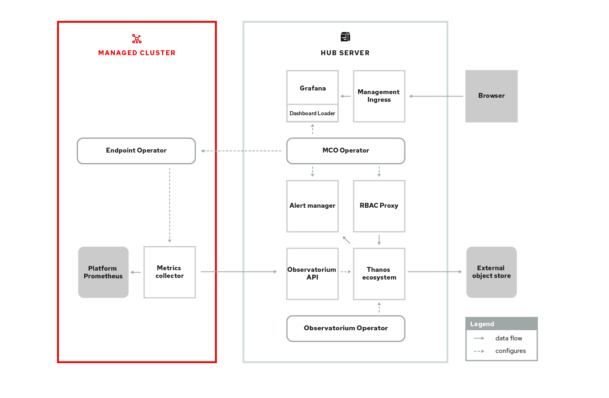

# Observability Overview

This document attempts to explain how the different components in Open Cluster Management Observabilty come together to deliver multicluster fleet observability. We do leverage several open source projects: [Grafana](https://github.com/grafana/grafana), [Alertmanager](https://github.com/prometheus/alertmanager), [Thanos](https://github.com/thanos-io/thanos/), [Observatorium Operator and API Gateway](https://github.com/observatorium), [Prometheus](https://github.com/prometheus/prometheus); We also leverage a few [Open Cluster Mangement projects](https://open-cluster-management.io/) namely - [Cluster Manager or Registration Operator](https://github.com/open-cluster-management/registration-operator), [Klusterlet](https://github.com/open-cluster-management/registration-operator), [multicloud operators placementrule](https://github.com/open-cluster-management/multicloud-operators-placementrule). The multicluster-observability operator is the root operator which pulls in all things needed.

## Conceptual Diagram



## Associated Github Repositories

Component |Git Repo	| Description	
---  | ------ | ----  
MCO Operator | [multicluster-observability-operator](https://github.com/open-cluster-management/multicluster-observability-operator) | Operator for monitoring. This is the root repo. If we follow the Readme instructions here to install, the code from all other repos mentioned below are used/referenced.
Endpoint Operator | [endpoint-metrics-operator](https://github.com/open-cluster-management/endpoint-metrics-operator) | Operator that manages  setting up observability and data collection at the managed clusters.
Observatorium Operator | [observatorium-operator](https://github.com/open-cluster-management/observatorium-operator) | Operator to deploy the Observatorium project. Inside the open cluster management, at this time, it means metrics using Thanos. Forked from main observatorium-operator repo.
Metrics collector | [metrics-collector](https://github.com/open-cluster-management/metrics-collector) | Scrapes metrics from Prometheus at managed clusters, the metric collection being shaped by configuring allow-list. 
RBAC Proxy | [rbac_query_proxy](https://github.com/open-cluster-management/rbac-query-proxy) | Helper service that acts a multicluster metrics RBAC proxy.
Grafana | [grafana](https://github.com/open-cluster-management/grafana) | Grafana repo -  for  dashboarding and metric analytics. Forked from main grafana repo.
Dashboard Loader | [grafana-dashboard-loader](https://github.com/open-cluster-management/grafana-dashboard-loader) | Sidecar proxy to load grafana dashboards from configmaps. 
Management Ingress | [management-ingress](https://github.com/open-cluster-management/management-ingress) | NGINX based ingress controller to serve Open Cluster Management services. 
Observatorium API | [observatorium](https://github.com/open-cluster-management/observatorium) | API Gateway which controls reading, writing of the Observability data to the backend infrastructure. Forked from main observatorium API repo.
Thanos Ecosystem | [kube-thanos](https://github.com/open-cluster-management/kube-thanos) | Kubernetes specific configuration for deploying Thanos. The observatorium operator leverages this configuration to deploy the backend Thanos components.

## Quick Start Guide

### Prerequisites

- git
- go version v1.15+
- docker version 17.03+
- kubectl version v1.16.3+
- kustomize version v3.8.5+
- operator-sdk version v1.4.2+
- access to an OCP v4.6+ cluster

> Note: By default, the API conversion webhook use on the Openshift service serving certificate feature to manage the certificate, you can replace it with cert-manager if you want to run the multicluster-observability-operator in a kubernetes cluster.

Use the following quick start commands for building and testing the multicluster-observability-operator:

### Clone the Repository

Check out the multicluster-observability-operator repository.

```
$ git clone git@github.com:open-cluster-management/multicluster-observability-operator.git
$ cd multicluster-observability-operator
```

### Build the Operator

Build the multicluster-observability-operator image and push it to a public registry, such as quay.io:

```
$ make -f Makefile.prow docker-build docker-push IMG=quay.io/<YOUR_USERNAME_IN_QUAY>/multicluster-observability-operator:latest
```

### Run the Operator in the Cluster

1. Create the `open-cluster-management-observability` namespace if it doesn't exist:
```
$ kubectl create ns open-cluster-management-observability
```

2. Deploy the minio service which acts as storage service of the multicluster observability:
```
$ git clone --depth 1 git@github.com:open-cluster-management/observability-e2e-test.git
$ kubectl -n open-cluster-management-observability apply -f observability-e2e-test/cicd-scripts/e2e-setup-manifests/minio
```

3. Replace the operator image and deploy the multicluster-observability-operator:
```
$ make -f Makefile.prow deploy IMG=quay.io/<YOUR_USERNAME_IN_QUAY>/multicluster-observability-operator:latest
```

4. Deploy the multicluster-observability-operator CR:
```
$ kubectl apply -f config/samples/observability_v1beta2_multiclusterobservability.yaml
```

5. Verify all the components for the Multicluster Observability are starting up and runing:
```
$ kubectl -n open-cluster-management-observability get pod
NAME                                                              READY   STATUS    RESTARTS   AGE
alertmanager-0                                      2/2     Running   0          5m
grafana-6878c8b44-kxx6k                             2/2     Running   0          5m
minio-79c7ff488d-rqmfg                              1/1     Running   0          5m
observability-observatorium-api-8646457ff9-6kw5v    1/1     Running   0          5m
observability-thanos-compact-0                      1/1     Running   0          5m
observability-thanos-query-fdc9b77b-7hxgc           1/1     Running   0          5m
observability-thanos-query-frontend-8764896b99597   1/1     Running   0          5m
observability-thanos-receive-controller-86982stcb   1/1     Running   0          5m
observability-thanos-receive-default-0              1/1     Running   0          5m
observability-thanos-rule-0                         2/2     Running   0          5m
observability-thanos-store-memcached-0              2/2     Running   0          5m
observability-thanos-store-shard-0-0                1/1     Running   0          5m
observatorium-operator-845dc69ccf-gdzn2             1/1     Running   0          5m
rbac-query-proxy-559b788777-ssmls                   1/1     Running   0          5m
```

### Uninstall the Operator in the Cluster

1. Delete the multicluster-observability-operator CR:

```
$ kubectl -n open-cluster-management-observability delete -f config/samples/observability_v1beta2_multiclusterobservability.yaml
```

2. Delete the multicluster-observability-operator:

```
$ make -f Makefile.prow undeploy
```

3. Delete the minio service:

```
$ kubectl -n open-cluster-management-observability delete -f observability-e2e-test/cicd-scripts/e2e-setup-manifests/minio
```

4. Delete the `open-cluster-management-observability` namespace:

```
$ kubectl delete ns open-cluster-management-observability
```
